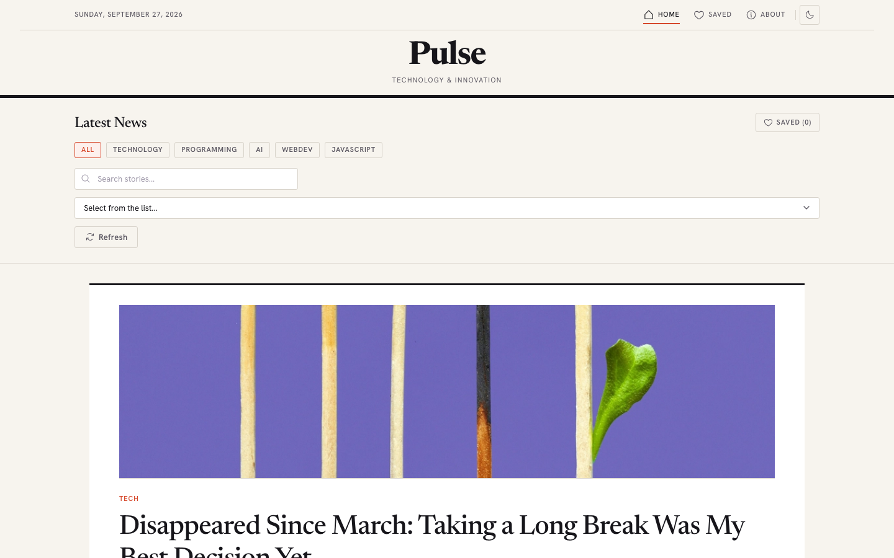
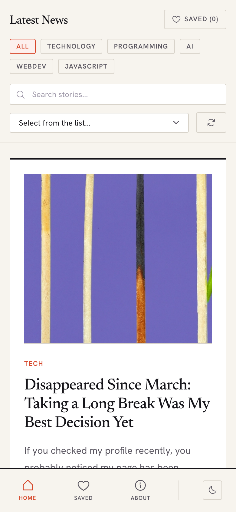

# Pulse

[](https://github.com/egorov-tech/pulse/actions/workflows/ci.yml)


Лента технологических статей на Vue 3 в стиле газеты: бесконечная прокрутка, теги,
поиск, избранное, светлая и тёмная тема. Данные — публичный [Dev.to API](https://developers.forem.com/api),
ключ не нужен.

**Демо:** <https://egorov-tech.github.io/pulse/>

| Десктоп | Мобильный |
|:-:|:-:|
|  |  |

## Что умеет

- **Лента** с бесконечной прокруткой через свою директиву `v-intersection`
- **Фильтр по тегам**, поиск и сортировка поверх загруженных статей
- **Избранное** с сохранением в `localStorage`
- **Детали статьи** в модальном окне с фокусом на кнопке закрытия
- **Тема** light / dark, мобильная навигация снизу

## Архитектура

```
src/
├── features/posts/
│   ├── pages/        экраны: лента, избранное, о проекте
│   ├── components/   PostList, PostItem, PostDetailsModal
│   ├── store/        Vuex-модуль: state, getters, mutations, actions
│   └── services/     newsService — клиент Dev.to и маппинг в модель статьи
├── shared/
│   ├── ui/           UI-кит (кнопка, инпут, селект, уведомления, навигация)
│   └── lib/          директивы v-focus, v-intersection, утилиты дат
└── router/
```

Фича собрана в одной папке по принципу feature-first: всё, что относится к статьям,
лежит в `features/posts`, общий UI и утилиты — в `shared`. Сервис отдаёт наружу уже
доменную модель статьи, и компоненты не знают о формате ответа Dev.to.

## Решения и компромиссы

**Лента не пустеет, если API упал.** `fetchPosts` при ошибке сети подставляет
локальные резервные статьи и показывает ошибку, а не пустой экран. Цена — резервные
данные нужно поддерживать вручную.

**Фильтрация на клиенте.** Поиск и сортировка работают по уже загруженным статьям
(геттеры Vuex), без запросов на каждое нажатие. Это мгновенно, но ищет только
среди подгруженного — полнотекстовый поиск по Dev.to потребовал бы серверного API.

**Отказ от NewsAPI.** Первая версия работала на NewsAPI, но бесплатный тариф
блокирует запросы из браузера с чужого домена, а ключ пришлось бы отдавать клиенту.
Dev.to отдаёт публичные данные без ключа — демо на GitHub Pages работает у всех.

**SPA на GitHub Pages.** Pages не умеет отдавать `index.html` на любой путь, и
обновление страницы на `/pulse/posts` давало 404. Плагин в `vite.config.js` копирует
`index.html` в `404.html` при сборке — маршруты работают с красивыми URL без `#`.

## Качество

CI на каждый push и PR: ESLint (`eslint-plugin-vue`), тесты (Vitest + Vue Test Utils),
сборка. Тесты:
- лента рендерит статьи из API и показывает резервные при его падении (API подменён);
- `v-intersection` вызывает обработчик только при появлении цели и отключает
  `IntersectionObserver` при размонтировании;
- относительное время («5m ago», «2d ago») на зафиксированных часах.

## Запуск

```sh
git clone https://github.com/egorov-tech/pulse.git
cd pulse
npm install
npm run dev     # http://localhost:3000
```

| Команда | Что делает |
|---|---|
| `npm test` | тесты |
| `npm run lint` | ESLint |
| `npm run build` | продакшн-сборка |

## Стек

Vue 3 · Vuex 4 · Vue Router 4 · Vite 5 · Axios · Iconify · Vitest · Dev.to API

## Лицензия

[MIT](LICENSE)
